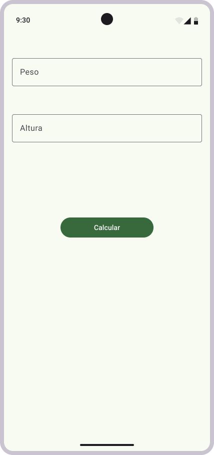

# Cálculo para Indice de Massa Corporal

> Este repositório foi desenvolvido com o objetivo de aprofundar conhecimentos na utilização do framework Flutter e da linguagem Dart.
Este aplicativo calcula o Índice de Massa Corporal (IMC) com base no peso e altura informados pelo usuário na tela.

## 💻 Pré-requisitos

Antes de começar, verifique se você atendeu aos seguintes requisitos:

- Você deve ter instalado a versão mais recente do `Android Studio (inferior à 2024.1.1)`, o `Flutter (versão menor ou igual à 3.27)` e o `Dart 3.6`.
- Você segue este requisitos neste site [Android Studio](https://developer.android.com/studio/install?hl=pt-br).

## 📫 Contribuindo para calculo-imc

Para contribuir com calculo-imc, siga estas etapas:

1. Bifurque este repositório.
2. Crie um branch: `git checkout -b <nome_branch>`.
3. Faça suas alterações e confirme-as: `git commit -m '<mensagem_commit>'`
4. Envie para o branch original: `git push origin <nome_do_projeto> / <local>`
5. Crie a solicitação de pull.

Como alternativa, consulte a documentação do GitHub em [como criar uma solicitação pull](https://help.github.com/en/github/collaborating-with-issues-and-pull-requests/creating-a-pull-request).

## 🤝 Colaboradores

Agradecemos às seguintes pessoas que contribuíram para este projeto:

<table>
  <tr>
    <td align="center">
      <a href="#" title="Foto de perfil">
         
        
          <b>Jean Carlos</b>
        
      </a>
    </td>
  </tr>
</table>
